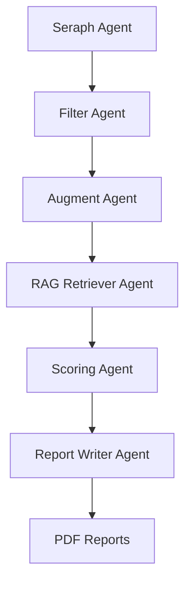
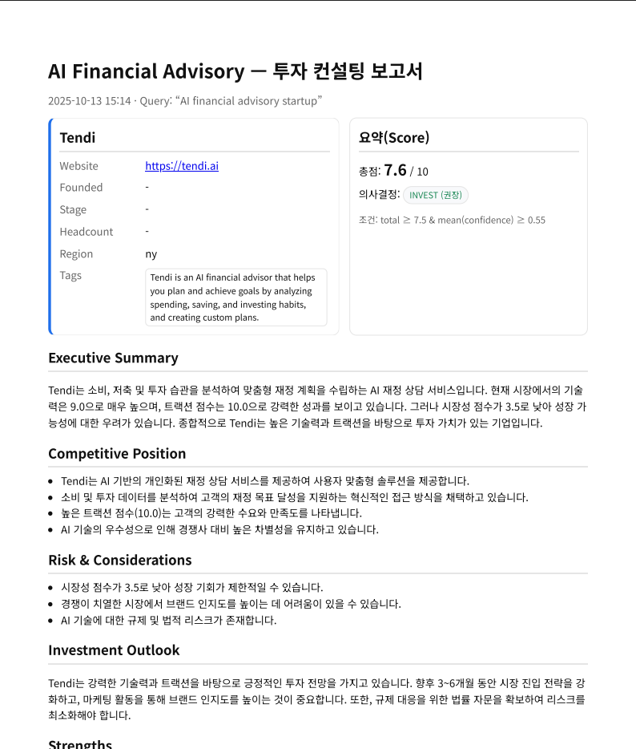

# 🧠 Agentic RAG — AI Startup Evaluation Pipeline  
*AI가 회사를 읽고, 평가하고, 리포트를 작성한다.*

---

## 🎯 프로젝트 개요

**Agentic RAG**는  
AI가 스타트업을 자동으로 **탐색·분석·평가·리포트화** 하는 **Agentic 파이프라인**입니다.  

투자자·컨설턴트·리서처가 직접 웹을 뒤지고 보고서를 작성하던 과정을,  
LangGraph 기반 멀티 에이전트 구조로 완전 자동화했습니다.

> 💡 목표: “AI가 AI 스타트업을 분석한다.”

---

## 🏗️ 아키텍처 개요



| Agent                 | 역할                        | 주요 기술                             |
| :-------------------- | :------------------------ | :-------------------------------- |
| **SeraphAgent**       | 회사 후보 검색 (Google/SerpAPI) | SerpAPI, OpenAI                   |
| **FilterAgent**       | 이름 정규화·중복제거·관련도 필터링       | FuzzyMatch, Similarity            |
| **AugmentAgent**      | HTML·PDF 크롤링 및 증강 임베딩 저장  | BeautifulSoup, pdfplumber, Chroma |
| **RAGRetrieverAgent** | Tavily로 외부 기사·공시 근거 보강    | Tavily API, requests              |
| **ScoringAgent**      | 축별 점수/신뢰도 계산              | GPT 기반 Scoring / Rule aggregation |
| **ReportWriterAgent** | 컨설팅형 PDF 리포트 생성           | Jinja2, Playwright, HTML Template |

---

## 🔄 데이터 플로우

```text
companies  →  chunks  →  evidence  →  scorecard  →  reports
```

| 단계          | 데이터 예시                                                             |
| ----------- | ------------------------------------------------------------------ |
| `companies` | [{name: "Tendi", website: "[https://tendi.ai](https://tendi.ai)"}] |
| `chunks`    | HTML·PDF에서 추출된 텍스트 블록                                              |
| `evidence`  | 축(axis)별 분류된 근거(텍스트, 출처, 날짜, 강도)                                   |
| `scorecard` | 7개 축(ai_tech~deployability)별 점수·신뢰도                                |
| `reports`   | 완성된 HTML/PDF 리포트                                                   |

---

## ⚙️ 주요 기능

✅ **Seraph → Filter → Augment → RAGRetriever → Scoring → Report 전체 자동화**
✅ **AI가 직접 웹을 읽고, 근거를 분류해 점수화**
✅ **LangGraph 기반 플로우 제어 및 병렬화**
✅ **Evidence(강도·텍스트·출처·날짜) 자동 정리**
✅ **Jinja2 + Playwright로 컨설팅 스타일 PDF 생성**

---

## 🧩 기술 스택

| 분류            | 기술                                     |
| ------------- | -------------------------------------- |
| **언어**        | Python 3.11+                           |
| **AI/LLM**    | OpenAI GPT-4o / text-embedding-3-small |
| **Vector DB** | ChromaDB (cosine similarity)           |
| **크롤링**       | requests, BeautifulSoup, pdfplumber    |
| **검색**        | Tavily API, SerpAPI                    |
| **RAG 프레임워크** | LangGraph                              |
| **리포트 생성**    | Jinja2, Playwright (HTML→PDF)          |
| **환경 관리**     | uv / .env                     |

---

## 🧭 실행 방법

### 1️⃣ 환경 준비

```bash
uv sync
cp .env.example .env
# .env에 OPENAI_API_KEY, TAVILY_API_KEY 입력
```

### 2️⃣ 파이프라인 실행

```bash
python -m graph.run --query "{자연어로 검색가능}"
```

### 3️⃣ 시각화 (LangGraph)

```bash
python -m graph.visualize.py
```

→ `graph.png`로 파이프라인 구조 시각화

### 4️⃣ 결과 확인

```bash
ls outputs/reports/
# 예시: Tendi.pdf
```

---

## 📊 출력 예시

### 결과 테이블

```
┏━━━━━┳━━━━━━━━━┳━━━━━━━━┳━━━━━━━━━━━━┓
┃ #   ┃ Company ┃ Total  ┃ Decision   ┃
┡━━━━━╇━━━━━━━━━╇━━━━━━━━╇━━━━━━━━━━━━┩
│ 1   │ Tendi   │ 9.60   │ invest     │
│ 2   │ ????    │ 5.15   │ hold       │
└─────┴─────────┴────────┴────────────┘
```

### PDF 리포트 예시



**구성 섹션**

1. Executive Summary
2. Competitive Position
3. Risk & Considerations
4. Investment Outlook
5. Strengths
6. Weaknesses
7. Evidence by Axis (근거 표)
8. Conclusion

---

## 🧠 핵심 모듈 요약

### `augment_agent.py`

* 기업 웹사이트 + 화이트리스트 도메인 자동 크롤링
* HTML/PDF에서 텍스트 추출 → AI기반 axis 분류
* 게시일·강도·출처 자동 라벨링
* 결과는 `ChromaDB` 및 `PipelineState.chunks`에 저장

### `rag_retriever_agent.py`

* Tavily API로 최신 기사·공시 탐색
* BeautifulSoup으로 본문 파싱
* 각 axis별 3~5개 근거 문서 확보

### `scoring_agent.py`

* 축별 evidence를 종합해 점수 및 신뢰도 계산
* 다양성·신뢰도·최신성(recency)을 고려한 blended confidence
* Gate: (total ≥ 7.5) & (confidence ≥ 0.55)

### `report_writer_agent.py`

* Jinja2 HTML 템플릿(`report.html.j2`) 기반
* GPT를 활용해 Executive Summary, Risk, Outlook 자동 작성
* Playwright로 PDF 렌더링 및 저장

---

## 📈 성과 및 인사이트

* **완전 자동화된 리서치 파이프라인** 구현
* **AI 기반 근거 중심 평가 체계화**
* **PDF 리포트 자동 생성**으로 실무 리서치 워크로드 대폭 절감
* **LangGraph 구조 시각화**로 에이전트 흐름 투명화

---

## 🔮 향후 개선 방향

* [ ] 회사 메타데이터(founded, stage, headcount, region) 자동 추출
* [ ] Evidence 내 실제 텍스트·날짜·출처 표시 강화
* [ ] 더 다양한 근거 데이터 수집
* [ ] retriever 개선해 evidence 신뢰성 강화
* [ ] LangSmith를 적용해 event tracing 시각화
* [ ] 평가 모델 다변화 (GPT-4o vs Claude vs Gemini 비교)

---

## 👥 팀 및 역할

| 이름 | 역할 |
| ---- | ---- |
| [**한창현**](https://github.com/skala-changhyun) | Discovery / Filter |
| [**신유나**](https://github.com/shinnandaa) | Augment |
| [**강진엽**](https://github.com/JinYeopKang) | Vector / RAG |
| [**서영재**](https://github.com/seo-youngjae) | Scoring |
| [**고나연**](https://github.com/konayeon11) | Report |
| [**원기훈**](https://github.com/nOOne-is-hier) | 파이프라인 설계, 데이터플로우 통합 |

---

## 📂 디렉토리 구조

```
eval_agent/
 ├─ agents/
 │   ├─ augment_agent.py
 │   ├─ filter_agent.py
 │   ├─ rag_retriever_agent.py
 │   ├─ report_writer_agent.py
 │   ├─ scoring_agent.py
 │   └─ seraph_agent.py
 ├─ graph/
 │   ├─ graph.py
 │   ├─ run.py
 │   ├─ state.py
 │   └─ visualize.py
 ├─ db/chroma_db/
 ├─ docs/templates/report.html.j2
 ├─ outputs/reports/
 └─ README.md
```

---

## 🧩 참고 자료

* [LangGraph Documentation](https://python.langchain.com/docs/langgraph/)
* [Tavily Search API](https://docs.tavily.com/)
* [Chroma VectorDB](https://docs.trychroma.com/)
* [Playwright Python](https://playwright.dev/python/)
* [SKALA 2nd - Project Owner](https://github.com/skala1-3/eval_agent)

---

> “From Retrieval to Reasoning — Agentic RAG makes evaluation autonomous.”
